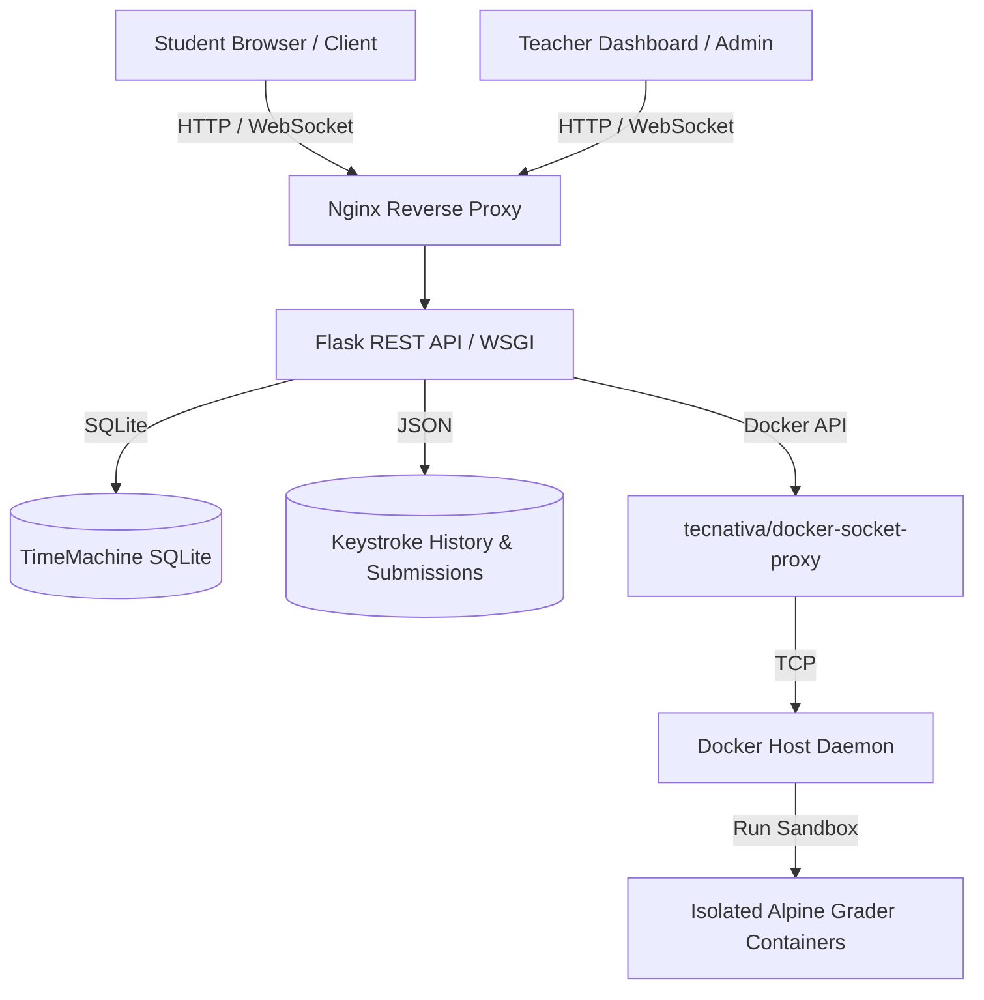

# 🎓 ExamIDE — Gerçek Zamanlı Programlama Sınav Sistemi

**ExamIDE**, bilgisayar mühendisliği ve yazılım geliştirme gibi alanlarda kağıt üzerinde kod yazma devrini sonlandırarak öğrencilerin modern, gerçek zamanlı ve güvenli bir ortamda kod yazıp test edebilmelerini sağlamak amacıyla geliştirilmiş bir **online IDE ve sınav yönetim sistemidir**.

Sistem; öğrencilere LeetCode/HackerRank benzeri bir arayüz sunarken, öğretmenlere ise tüm laboratuvarı anlık olarak takip edebilecekleri, öğrencilerin kod yazma süreçlerini harf harf oynatıp inceleyebilecekleri kapsamlı bir admin paneli sunar.

---

## 🛠️ Mimari ve Teknolojik Altyapı

ExamIDE, yüksek güvenlik, performans ve veri kurtarma ihtiyaçlarına yanıt verecek şekilde çok katmanlı mikroservis mimarisiyle tasarlanmıştır:



### 1. Bileşenler ve Görevleri
- **Nginx (Reverse Proxy):** Dış dünyaya yalnızca 80. portu açar. Statik dosyaları sunar, istek yönlendirmelerini yapar, hız sınırlaması (rate limiting) uygular ve WebSocket trafiğini yönetir.
- **Flask (Backend API):** Sınav akışı, öğrenci kayıtları, canlı durum takibi ve Docker konteyner havuzunun (`WarmContainerPool`) yönetiminden sorumludur. `ProxyFix` entegrasyonu sayesinde proxy arkasındaki gerçek istemci IP'lerini doğru şekilde çözümler.
- **Docker Socket Proxy (`docker-proxy`):** Güvenlik duvarı görevi görür. Backend'in doğrudan `/var/run/docker.sock` dosyasına erişmesi engellenerek Docker API'ye salt okunur ve kısıtlı bir TCP proxy üzerinden erişim sağlanır. Sadece güvenli konteyner oluşturma, çalıştırma ve silme komutlarına (`CONTAINERS=1`, `POST=1`, `DELETE=1`, `EXEC=1`, `NETWORKS=1`) izin verilir.
- **Grader Base (`exam-grader-iso`):** Öğrencilerin yazdığı kodları derlemek ve test senaryolarıyla karşılaştırmak üzere tamamen izole, ağ bağlantısı kesilmiş (sandbox) Docker konteynerleri oluşturur. C/C++, Python ve C# dillerini destekler.
- **SQLite (TimeMachine DB):** Aktif sınav verisini, kayıtlı öğrencileri ve en son kod durumlarını elektrik kesintisi veya sunucu çökmesi gibi durumlara karşı anlık olarak veritabanında saklar.
- **Dosya Sistemi (Submissions & History):** Sınav bittiğinde teslim edilen kodları (`grader/submissions/`) ve öğrencilerin sınav boyu gerçekleştirdiği tüm klavye vuruşlarını (`grader/history/`) saklar.

---

## ✨ Öne Çıkan Özellikler

### 1. Gerçek Zamanlı Öğrenci Takibi (Live Monitoring)
Admin panelinden sınava giren tüm öğrencilerin ad-soyad, bölüm, sınıf, IP adresi, şu an çözmekte olduğu soru numarası, son aktif olduğu an ve bağlantı durumu (çevrimiçi/çevrimdışı) saniye saniye canlı olarak izlenebilir.

### 2. TimeMachine (Oturum Kurtarma)
Öğrencinin yazdığı kodlar her **10 saniyede bir** arka planda otomatik olarak SQLite veritabanına kaydedilir. Olası bir elektrik kesintisi, sunucu kapanması veya ağ kopmasında, admin panelinden tek tuşla **"Oturumu Geri Yükle"** denilerek tüm öğrencilerin sınavı, yazdıkları son kodlarla birlikte kaldığı yerden başlatılabilir.

### 3. Kod Yazma Geçmişi ve Geri Sarma (Keystroke Playback)
Sistem, öğrencilerin kod editöründe yaptığı her değişikliği bir zaman damgasıyla birlikte kaydeder. Öğretmen, admin panelinde herhangi bir öğrencinin yanındaki **"İzle"** butonuna basarak, öğrencinin o soruda yazdığı kodu ilk harfinden son haline kadar video oynatır gibi ileri/geri sararak izleyebilir. Bu özellik kopya tespiti ve algoritma geliştirme sürecinin analizi için kritik öneme sahiptir.

### 4. İzole Kod Çalıştırma (Sandboxing)
Öğrencilerin yazdığı kodlar, ana sisteme veya diğer öğrencilere zarar verememesi için:
- İnternet erişimi kapatılmış (`network_disabled=True`),
- Bellek limiti sınırlandırılmış (`128MB`),
- Çalışma süresi `timeout 10` ile maksimum 10 saniyeyle kısıtlanmış Docker konteynerleri içerisinde çalıştırılır.

---

## 🚀 Kurulum ve Çalıştırma

Projeyi çalıştırmadan önce bilgisayarınızda **Docker** ve **Docker Compose** kurulu olmalıdır.

### 1. Çevre Değişkenleri (`.env`)
Proje dizininde `backend/.env` adında bir dosya oluşturup aşağıdaki değişkenleri tanımlayın:
```env
PORT=5000
BASE_URL=http://localhost
SECRET_KEY=kendi_guvenli_anahtariniz_buraya
```

### 2. Sistemi Başlatma
Terminalde proje kök dizinine giderek aşağıdaki komutu çalıştırın:
```bash
docker-compose up -d --build
```
Bu komut sırasıyla:
1. Docker socket güvenlik proxy'sini kurar.
2. Flask backend uygulamasını derleyip ayağa kaldırır.
3. Nginx sunucusunu yapılandırıp dış dünyaya açar.
4. Kod değerlendirme için kullanılacak `exam-grader-iso` izole imajını yerelde derler.

### 3. Uygulamaya Erişim
- **Öğrenci Giriş Ekranı:** [http://localhost](http://localhost)
- **Admin Giriş Ekranı:** Flask backend ilk çalıştığında terminal loglarına **rastgele üretilmiş güvenli bir giriş URL'si** yazdırır. Logları incelemek için:
  ```bash
  docker-compose logs backend
  ```
  Çıktıda aşağıdaki gibi bir satır göreceksiniz:
  ```text
  Admin Login Link: http://localhost/login?token=rastgele_guvenli_token_degeri
  ```
  Bu linke tıklayarak admin paneline şifresiz ve güvenli bir şekilde giriş yapabilirsiniz.

---

## 📂 Klasör Yapısı

```text
ExamIDE/
├── backend/
│   ├── routes/              # API Rotaları (client_routes.py, admin_routes.py, auth_routes.py)
│   ├── execution_pool.py    # Docker Konteyner Havuzu (WarmContainerPool) yönetimi
│   ├── timemachine.py       # SQLite durum yedekleme ve yükleme işlemleri
│   ├── __init__.py          # Flask uygulama başlatıcısı, CSRF ve ProxyFix ayarları
│   └── Dockerfile           # Backend servis imajı
├── frontend_client/         # Öğrenci Arayüzü (HTML, CSS, Monaco Editor JS)
├── frontend_admin/          # Öğretmen Kontrol Paneli Arayüzü
│   ├── modules/             # Panel bileşenleri (Exam Builder, Playback, TimeMachine vb.)
│   └── js/                  # Öğrenci izleme, playback oynatıcı ve sınav yönetimi JS kodları
├── grader/
│   ├── test_cases/          # Sınav esnasında otomatik oluşturulan test senaryoları
│   ├── submissions/         # Öğrencilerin teslim ettiği nihai sınav dosyaları (JSON)
│   ├── history/             # Keystroke (tuş vuruşu) JSONL geçmiş dosyaları
│   ├── Dockerfile.exec      # İzole kod çalıştırıcı taban imajı
│   └── timemachine.db       # TimeMachine SQLite veritabanı dosyası
├── nginx/
│   └── nginx.conf           # Rate limit, proxy_set_header ve WebSocket yapılandırması
├── docker-compose.yml       # Çoklu servis orkestrasyon dosyası
└── run.py                   # Uygulama ana giriş noktası (token üretici)
```

---

## 📝 Sınav JSON Yapısı (.json)

Admin panelinden yeni bir sınav başlatmak için yükleyeceğiniz dosya şu formatta olmalıdır:

```json
{
  "exam_id": "exam_1720000000",
  "name": "Nesne Yönelimli Programlama - Final Sınavı",
  "description": "Python dilinde 2 sorudan oluşan final sınavı. Başarılar.",
  "time": "90",
  "language": "python",
  "questions": {
    "1": {
      "title": "Asal Sayı Kontrolü",
      "description": "Verilen sayının asal olup olmadığını kontrol eden bir program yazın.",
      "points": 50,
      "run-time-limit": 5,
      "memory-limit": 1024,
      "test-cases": [
        {
          "input": "7",
          "expected": "True"
        },
        {
          "input": "10",
          "expected": "False"
        }
      ]
    },
    "2": {
      "title": "Dizi Elemanlarını Toplama",
      "description": "Gönderilen sayı listesinin elemanları toplamını ekrana yazdırın.",
      "points": 50,
      "run-time-limit": 5,
      "memory-limit": 1024,
      "test-cases": [
        {
          "input": "1 2 3 4 5",
          "expected": "15"
        }
      ]
    }
  }
}
```

---

## 🔒 Güvenlik Notları
1. **İç Ağ Yapılandırması:** Nginx ve backend arasındaki tüm iletişim ile `docker-proxy` bağlantısı dışarıya kapalı bir `internal-network` üzerinde gerçekleşir.
2. **Double-Submit Cookie CSRF:** Admin panelinde gerçekleştirilen tüm aksiyonlar (sınavı durdurma, başlatma, sıfırlama) CSRF korumalıdır.
3. **Impersonation Koruması:** Teslim etme (`/submit`) ve kod kaydetme (`/save_code`) isteklerinde istemciden gönderilen ID'ler yerine tamamen Flask oturumundaki (session) doğrulanmış kullanıcı kimlikleri baz alınır. Path traversal saldırılarına karşı parametre temizliği (sanitization) yapılır.

## 📄 Lisans
Bu proje eğitim kurumlarında programlama sınavlarının dijitalleştirilmesi amacıyla açık kaynaklı olarak geliştirilmiştir. Ticari kullanım ve özelleştirmeler için geliştiriciyle iletişime geçebilirsiniz.
